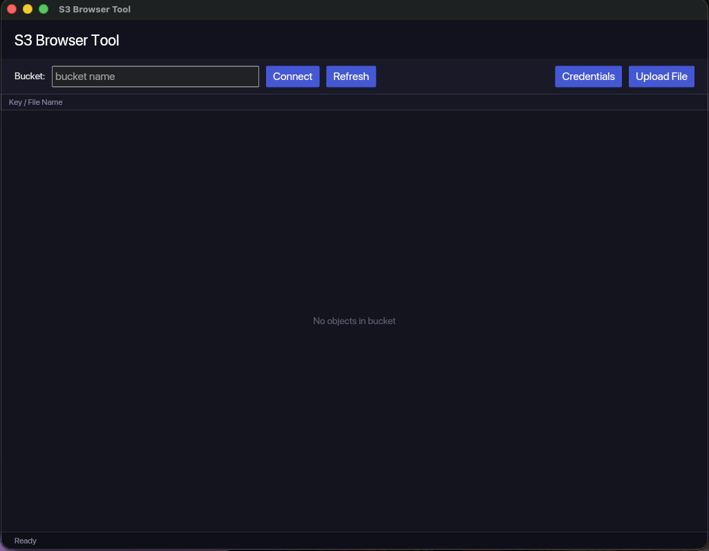

# S3 Browser Tool

Desktop GUI and CLI for browsing and managing Amazon S3 buckets, built with Rust and the AWS SDK for Rust.

The GUI uses [Iced](https://iced.rs/) with a dark theme. The CLI uses [Clap](https://docs.rs/clap) for argument parsing.

## Features

- List objects in an S3 bucket
- Upload files to a bucket
- Download objects to a local file
- Delete objects with confirmation (GUI) or direct command (CLI)
- GUI stores AWS credentials securely in the Apple Keychain
- Installable macOS app bundle with custom icon
- Credentials and bucket name can also come from `.env` or the standard AWS provider chain

## Prerequisites

- [Rust](https://rustup.rs/) (stable, 2024 edition)
- AWS credentials with the following permissions on your bucket:
  - `s3:ListBucket`
  - `s3:PutObject`
  - `s3:GetObject`
  - `s3:DeleteObject`

## Configuration

### GUI: Apple Keychain (recommended)

On first launch the GUI opens a credentials dialog automatically. Enter your
Access Key ID, Secret Access Key, and optional region, then click
**Save to Keychain**. Credentials are stored in the macOS Keychain under the
service name "S3 Browser Tool" and used on every launch. Update them anytime
via the **Credentials** toolbar button.

Keychain credentials take priority. If none are stored, the app falls back to
the standard AWS provider chain (environment variables, `~/.aws/credentials`).

### CLI / fallback: `.env` file

Create a `.env` file in the project root (never committed to git):

```env
AWS_ACCESS_KEY_ID=your_access_key
AWS_SECRET_ACCESS_KEY=your_secret_key
AWS_REGION=us-east-1
AWS_S3_BUCKET=your-bucket-name
```

Region defaults to `us-east-1` if unset. The CLI also accepts `--region` and `--bucket` flags to override.

## Build

### GUI only

```bash
cargo build --release --bin s3_browser_tool
```

### CLI only

```bash
cargo build --release --bin cli
```

### Both

```bash
cargo build --release
```

Compiled binaries are at `target/release/s3_browser_tool` (GUI) and `target/release/cli` (CLI).

### macOS app bundle

```bash
scripts/bundle.sh            # build "S3 Browser Tool.app" in target/release/bundle/
scripts/bundle.sh --install  # build and install into /Applications
```

The script builds the release binary, generates the app icon
(`assets/make_icon.py`, requires Python 3 with Pillow), assembles the `.app`
bundle with `Info.plist`, and ad-hoc signs it so Keychain access persists.

## Run

### GUI

```bash
cargo run --release --bin s3_browser_tool
```

Or:

```bash
./target/release/s3_browser_tool
```



The main window: enter a bucket name in the toolbar and click **Connect** to
list the bucket's objects. The status bar at the bottom shows the object count
and operation results.

**Usage:**
- Bucket from `.env` is pre-loaded on startup and objects listed automatically
- Change the bucket in the text field and click **Connect** to switch buckets
- Click **Refresh** to reload the object list
- Click **Upload File** → use **Browse** for a native file picker or type a path manually
- **Right-click** any object to open the context menu (Download via native save dialog; Delete, with confirmation dialog)

---

### CLI

```bash
cargo run --release --bin cli -- --help
```

Or:

```bash
./target/release/cli --help
```

**Subcommands:**

```
USAGE:
    cli [OPTIONS] --bucket <BUCKET> <COMMAND>

OPTIONS:
    -r, --region <REGION>    AWS region [env: AWS_REGION]
    -b, --bucket <BUCKET>    S3 bucket name [env: AWS_S3_BUCKET]
    -v, --verbose            Print version and config info
    -h, --help               Print help

COMMANDS:
    list-objects             List objects in the bucket
    upload-file              Upload a local file to the bucket
    delete-file              Delete an object from the bucket
    download-file            Download an object from the bucket to a local file
```

**Examples:**

```bash
# List objects (bucket from .env)
cargo run --bin cli -- list-objects

# Upload a file
cargo run --bin cli -- upload-file --file-name ./report.pdf

# Download an object (optionally to a specific path with --output)
cargo run --bin cli -- download-file --file-name report.pdf

# Delete an object
cargo run --bin cli -- delete-file --file-name report.pdf

# Override bucket and region
cargo run --bin cli -- --bucket my-other-bucket --region us-west-2 list-objects
```

## Project Structure

```
src/
  main.rs        # Iced GUI application (binary: s3_browser_tool)
  lib.rs         # S3 operations (list, upload, download, delete) — shared by GUI and CLI
  error.rs       # S3ExampleError type
  bin/
    cli.rs       # Clap CLI application (binary: cli)
```
